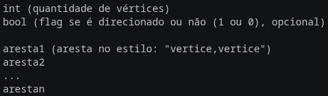

# DIM0549-grafos-works

Este projeto implementa algoritmos de grafos em C++.

## Requisitos

- CMake >= 3.10
- Compilador C++ (recomendado: g++ >= 7)

## Como compilar e executar

1. Clone o repositório ou navegue até a pasta do projeto.

2. Gere os arquivos de build com o CMake:

```bash
cmake -S . -B build
```

3. Compile o projeto:

```bash
cmake --build build
```

4. Execute o programa:

```bash
./build/grafos <caminho-do-arquivo> [opções]
```

onde: 

<caminho-do-arquivo> (obrigatório) é o caminho do arquivo de leitura

### Opções de execução:

| Flag | Nome Completo | Descrição |
| :--- | :----------- | :----------------------------------- |
| `-c` | `--char`     | Define vértices como **char**.       |
| `-i` | `--int`      | Define vértices como **int**.        |
| `-d` | `--directed` | Define o grafo como **direcionado**. |

**Exemplo de uso:**
```bash
 ./build/grafos entrada.txt -c -d  
 #(Lê o arquivo entrada.txt, com vértices do tipo char, formatado como um grafo direcionado).
 ```
## Estrutura do arquivo de leitura

Os arquivos de leitura devem possuir a extensão .txt. 
A primeira linha deverá conter o número total de vértices. A segundo **PODERÁ** ter uma flag (0 ou 1) que irá definir se o grafo é direcionado (0 -> Grafo, 1 -> DiGrafo), sendo completamente opcional para o funcionamento do programa. Por padrão, essa flag sobrescreverá a opção `-d` ou `--directed` da linha de comando. Caso nenhuma dessas flags seja utilizada, o grafo será gerado como um grafo não direcionado.
Após isso, as linhas seguintes deverão conter as arestas separadas com vírgula.

<div align="center">

</div>

Exemplo:

<div align="center">
 
</div>

## Estrutura geral do programa

```
DIM0549-grafos-works/
├── include/
│   ├── parser/
│   │   ├── CreateParser.hpp    # Classe que cria o parser com base na escolha do tipo do arquivo de leitura (neste projeto, apenas .TXT)
│   │   ├── CreateParser.tpp    # Implementação em template da classe CreateParser
│   │   ├── GraphParser.hpp     # Classe abstrada que poderá ser extendida para parsers de vários tipos (neste projeto, apenas .TXT)
│   │   ├── TxtParser.hpp       # Classe filha de GraphParser que implementa o parser para arquivos .TXT
│   │   ├── TxtParser.tpp       # Implementação em template da classe TxtParser
│   ├── grafos.hpp              # Classe principal que implementa um Grafo
│   ├── grafos.tpp              # Implementação em template da classe Graph
├── pics/                       # Imagens utilizadas nesta documentação
├── main.cpp                    # Função Main que irá criar os objetos Parser e Grafo implementados e aplicar suas funções
├── CMakeLists.txt              # Configuração de compilação
└── README.md                   # Esta documentação
```
## Autores

<ul>
    <li> Heitor Campos  </li>
    <li> Leandro Andrade</li>
</ul>

## Licença

Este projeto é acadêmico e livre para uso.
